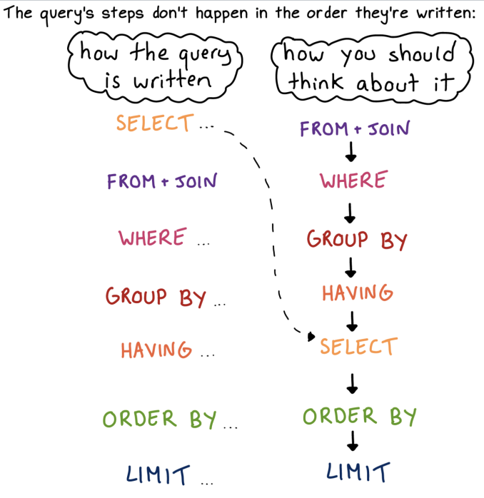

# Notes for SQL midterm
## Logistics: 
* **Part 1:** query focused (-want short commands / 1-2 joins) 
* **Part 2:** Just correctness focused. 
* Avoid using * in queries (even “COUNT(*)” is no good) 
* Basically always use single quotes???  (maybe except for datetime things? idk im confused)
  * **Magic quotes**: when you paste into vocareum it does weird shit. Be careful. 

## SQL notes: 
### Extra notes: [https://drive.google.com/file/d/1tVZ6kDe9u1XTVY2OyYFePzj14A2AdRcf/view?usp=sharing](https://drive.google.com/file/d/1tVZ6kDe9u1XTVY2OyYFePzj14A2AdRcf/view?usp=sharing) 

### 1: The™ Diagram™™



## Function zoo: 

### Select: 
* Can have functions, columns, or static values passed in. 
* Often use aliases for readability.
* Happens just before order by. 

**Aliasing column names:** [ref](https://www.w3schools.com/mysql/mysql_alias.asp)
* by default column names are what the surface form you have is (e.g. `SELECT COUNT(1) FROM tab` has column name `COUNT(1)`
  * add `as` to shorten things 
  * `as` aliases can be referenced in other clauses ? (TODO: CHECK THIS MIGHT NOT BE TRUE)


### From 
* Aliasing: use tablename followed by alias: 
```SQL
SELECT t1.id, t1.name FROM table1 t1 
```
### Joins: (join types & scemantics)
* Standard join scemantics `SELECT ... FROM table1 t1 JOIN table2 t2 ON <FIELD> `
* `ON` portion: any rowwise operation which results in true means row gets 'matched' (along cartesian product)

**Types:**
* **Inner** (standard): Take only elements where `ON` value is true for both. [link](https://www.w3schools.com/mysql/mysql_join_inner.asp)
```sql
SELECT * FROM table1 t1 JOIN table2 t2 ON t1.emp_id = t2.id
```
* **Left** (i.e. Left Outer): Take all elements from the left table, and match with elements from rite table where `ON ` condition is true. All other rows, will be filled with one element from left table and all `Nulls`.  [link](https://www.w3schools.com/mysql/mysql_join_left.asp)
```sql
SELECT * FROM table1 t1 LEFT JOIN table2 t2 ON t1.emp_id = t2.id
```
* **Right** (i.e. Right Outer): *Very bad form. Do not actually use smh* [link](https://www.w3schools.com/mysql/mysql_join_right.asp)
* **Outer** Make a row for each element of the intersection (where the `on` condition is true) as well as a row for each element in both the left and right tables... unfilled elements (from mismatches) are filled with `Null` values [link](https://www.w3schools.com/sql/sql_join_full.asp)
```sql
SELECT * FROM table1 t1 FULL OUTER JOIN table2 t2 ON t1.emp_id = t2.id
```
**Links:** [inner](https://www.w3schools.com/mysql/mysql_join_inner.asp), [left](https://www.w3schools.com/mysql/mysql_join_left.asp), [right](https://www.w3schools.com/mysql/mysql_join_right.asp), [outer](https://www.w3schools.com/mysql/mysql_join_outer.asp)


### Where:
[ref](https://www.w3schools.com/mysql/mysql_where.asp) 
* Selects only rows where the given predicate / condition is true. Syntax: 
```sql
SELECT * FROM table1 t1 WHERE <condition> 
```
#### Operators
| Name | symbol | Example |
|------|--------|---------|
| equal| `=`                | `... WHERE t1.fav_num = 3`
| not equal| `<>`           | `... WHERE t1.fav_num <> 3`
| greater than| `>`         | `... WHERE t1.fav_num >  3`
| greater or equal| `>=`    | `... WHERE t1.fav_num >= 2`
| less than| `<`            | `... WHERE t1.fav_num <  3`
| less or equal| `<=`       | `... WHERE t1.fav_num <= 2`

#### Logical Operators
| Name | symbol | Example |
|------|--------|---------|
| AND   | `AND` | `... WHERE fav_num > 3 AND fav_num < 7`
| OR    | `OR` | `... WHERE fav_num = 3 OR fav_num  = 7`
| NOT   | `NOT` | `... WHERE fav_num > 3 AND fav_num < 7`

#### Predicates
* `BETWEEN`: Checks if element is between two values, **INCLUSIVE**
  * **NOTE: weird syntax** e.g.: 
  * [link](https://www.w3schools.com/sql/sql_between.asp)
```sql
SELECT * FROM table t1 WHERE t1.fav_num BETWEEN  3 AND 5
```
* `IN`: takes parens: checks if element is in list 
  * Can be used for subqueries, put query that returns only one column in parens
  * [link](https://www.w3schools.com/sql/sql_in.asp)
```sql
SELECT * FROM table t1 WHERE t1.fav_num IN(2,3,5,7,11,13)
SELECT * FROM table t1 WHERE t1.fav_num IN(
        SELECT n.num for numbers n WHERE n.prime = TRUE )

```
* `LIKE` checks if string is almost equal (Should use wildcard `'%'`: roughly equivalent to regex `.*`. (unlearned is `'_'`  which is like regex `'.'`))
  * note single quotes
  * [ref](https://www.w3schools.com/sql/sql_like.asp)
```sql
SELECT * FROM table t1 WHERE t1.fav_name LIKE('%Eichenberger')
```

### Group by: 

* Makes into sub-tables which can be aggregated. Groups on all unique combinations of listed cols 
  * Note: this includes any function-based columns
  * Happens after `WHERE` clause 
  * **All fields in the associated `SELECT` clause must be either grouped by or aggregated**
  * If we assume that something will be the same can use `FIRST()` aggregator, as a shorthand 
* [ref](https://www.w3schools.com/mysql/mysql_groupby.asp)

**Aggregators:**
* Happen in `SELECT`  clause.

| Name          | symbol      | Example                 |  notes | link
|---------------|-------------|---------|---------------| ---
| count         | `COUNT()`   | `SELECT COUNT(t.cat_name) ... GROUP BY ...` | counts only non-`Null` elements of col. | [link](https://www.w3schools.com/mysql/mysql_count_avg_sum.asp)
| count all | `COUNT(1)`   | `SELECT COUNT(1) FROM emps e GROUP BY e.branch` | Counts number of rows. | [link](https://www.w3schools.com/mysql/mysql_count_avg_sum.asp)
| sum         | `SUM()`   | `SELECT SUM(e.num_kids) FROM emps e GROUP BY e.branch` | sums. Null's are ignored|[link](https://www.w3schools.com/mysql/mysql_count_avg_sum.asp)
| average         | `AVG()`   | `SELECT AVG(e.num_kids) FROM emps e GROUP BY e.branch` | Averages. Null's are ignored|[link](https://www.w3schools.com/mysql/mysql_count_avg_sum.asp)
| min, max         | `MIN()`, `MAX()`   | `SELECT MAX(e.num_kids) FROM emps e GROUP BY e.branch` | Averages. Null's are ignored|[link](https://www.w3schools.com/mysql/mysql_min_max.asp)
| first         | `FIRST()`   | `SELECT FIRST(e.city) FROM emps e GROUP BY e.branch` | Takes first element. Happens after `ORDER BY` clause. Also used for getting data when it is assumed that all elements of a groupby group will have the same value |

### Having: 
 * exactly the same as `WHERE` but happens after groupby and aggregation operations
 * [ref](https://www.w3schools.com/mysql/mysql_having.asp)


### Order by: 
* Select column to order by. 
* By default gives increasing order (small-big)
  * Use `ORDER BY <colname> DESC` to go big-small
* Random order: `ORDER BY RAND()`
* Hirerarchical ordering, list multiple columns: will order by first then second... 
* e.g.: 
```sql
SELECT * FROM Customers
ORDER BY Country ASC, CustomerName DESC;
```

### Miscellaneous functions: 

* **Distinct**: acts like groupby: gives only unique combination of columns
**Datetime functions:**

| Name          | symbol      | Example                 |  notes | link
|---------------|-------------|---------|---------------| ---
| Now         | `NOW()`   | `selct * from tab where tab.time = NOW()` | Returns datetime of now | [link](https://www.mysqltutorial.org/mysql-now/)
| date        | `DATE()`   | `selct * from tab where DATE(tab.time) = DATE(NOW())` | converts to date (no time) format| [link](https://www.mysqltutorial.org/mysql-date-functions/mysql-date-function/)
| month, day, year        | `MONTH()`,`DAY()`,`YEAR()`   | `selct * from tab where YEAR(tab.time) = 2022` | Gets the month, day or year as an int| [month](https://www.mysqltutorial.org/mysql-month/), [day](https://www.mysqltutorial.org/mysql-day/), [year](https://www.mysqltutorial.org/mysql-year/)
| str to datetime | `STR_TO_DATE(string,format)`| `SELECT STR_TO_DATE( '21,5,2013', '%d,%m,%Y');`| Format is specified according to [this](https://www.mysqltutorial.org/mysql-date_format/). All non-filled elements are set to 0. |  [link](https://www.mysqltutorial.org/mysql-str_to_date/)

https://phoenixnap.com/kb/mysql-date-function